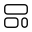

<a id="readme-top"></a>

<!-- PROJECT SHIELDS -->
<!--
*** I'm using markdown "reference style" links for readability.
*** Reference links are enclosed in brackets [ ] instead of parentheses ( ).
*** See the bottom of this document for the declaration of the reference variables
*** for contributors-url, forks-url, etc. This is an optional, concise syntax you may use.
*** https://www.markdownguide.org/basic-syntax/#reference-style-links
-->
<!-- PROJECT LOGO -->
<br />
<div align="center">
  <a href="https://github.com/belsedar/Belsedar's Backgrounds">
    
  </a>

  <h3 align="center">Belsedar's Backgrounds</h3>

  <p align="center">
    The home of the best collection of Public Domain backgrounds!
  </p>
</div>


<!-- TABLE OF CONTENTS -->
<details>
  <summary>Table of Contents</summary>
    <li>
      <a href="#about-the-project">About The Project</a>
      <ul>
    </li>
    <li>
      <a href="#getting-started">Getting Started</a>
      <ul>
        <li><a href="#prerequisites">Prerequisites</a></li>
        <li><a href="#installation">Installation</a></li>
      </ul>
    </li>
    <li><a href="#contributing">Contributing</a></li>
    <li><a href="#license">License</a></li>
    <li><a href="#contact">Contact</a></li>
    <li><a href="#acknowledgments">Acknowledgments</a></li>
  </ol>
</details>


<!-- ABOUT THE PROJECT -->
## About The Project


This is a continuation of the original Belsedar Wallpapers repository but drastically altered to be more compatible with Open-Source ideas. As such instead of storing all the wallpapers in the repo itself, they are now stored in PixelDrain and this repo is simply storing the easy install Python script and any additional resources. The wallpapers themselves have also been changed and swapped over to [Public Domain](https://en.wikipedia.org/wiki/Public_domain) images. 

### The Reasoning:

* Artists and photographers deserve to be paid for their work. And while in some jurisdictions and for some people personal, non-commercial use is acceptable, I would prefer people make an intentional and conscious choice to do that.
* Many Linux and FOSS purists prefer to have and entirely FOSS system, and that would include the default wallpapers on that system.
* Public Domain images don't have to be boring! In fact, in part the choice to move to only Public Domain images is to show that a lot of this art is still valuable aesthetically today.

<!-- GETTING STARTED -->
## Getting Started

Just pull the repo or directly download the install script. 
**DONT TRUST RANDOM SCRIPTS FROM THE INTERNET!** If at all possible read through the script and see what it does. 

### Prerequisites

The script needs the following dependencies:


* gowall 

Arch

  ```sh
  yay -S gowall
  ```
Fedora

  ```sh
 sudo dnf copr enable achno/gowall
sudo dnf install gowall
  ```
NixOS

  ```sh
   environment.systemPackages = [
    pkgs.gowall
  ];
  ```
### Installation

1. Clone the repo
   ```sh
   git clone https://github.com/Belsedar/Wallpapers.git
   ```

2. Navigate to the right directory
   ```sh
   cd Wallpapers
   ```
3. Execute the Python script
   ```sh
   Python3 Wallpapers.py
   ```


<!-- CONTRIBUTING -->
## Contributing

Contributions are what make the open source community such an amazing place to learn, inspire, and create. Any contributions you make are **greatly appreciated**, However I would appreciate if any suggestions of wallpaper additions had:

1. High Resolution
2. Are Public Domain or CC0

If you have any suggestions feel free to create an issue. If you notice that any of the already present backgrounds are not Public Domain or CC0, please also create an issue with proof that the image is claimed by someone’s copyright.

<!-- LICENSE -->
## License

Distributed under the Unlicense License. See `LICENSE.txt` for more information.


<!-- CONTACT -->
## Contact 

Belsedar - kernel.boxy972@silomails.com

<!-- ACKNOWLEDGMENTS -->
## Acknowledgments

Use this space to list resources you find helpful and would like to give credit to. I've included a few of my favorites to kick things off!

* [Choose an Open Source License](https://choosealicense.com)
* [Standard Ebooks](https://standardebooks.org/artworks?)
* [Gowall](https://github.com/Achno/gowall?tab=readme-ov-file)
* [Best Readme Template](https://github.com/othneildrew/Best-README-Template/blob/main/README.md)
* [Agvantibo](https://github.com/agvantibo-again/)
* [PixelDrain](pixeldrain.com)


<!-- MARKDOWN LINKS & IMAGES -->
<!-- https://www.markdownguide.org/basic-syntax/#reference-style-links -->
[contributors-shield]: https://img.shields.io/github/contributors/othneildrew/Best-README-Template.svg?style=for-the-badge
[contributors-url]: https://github.com/othneildrew/Best-README-Template/graphs/contributors
[forks-shield]: https://img.shields.io/github/forks/othneildrew/Best-README-Template.svg?style=for-the-badge
[forks-url]: https://github.com/othneildrew/Best-README-Template/network/members
[stars-shield]: https://img.shields.io/github/stars/othneildrew/Best-README-Template.svg?style=for-the-badge
[stars-url]: https://github.com/othneildrew/Best-README-Template/stargazers
[issues-shield]: https://img.shields.io/github/issues/othneildrew/Best-README-Template.svg?style=for-the-badge
[issues-url]: https://github.com/othneildrew/Best-README-Template/issues
[license-shield]: https://img.shields.io/github/license/othneildrew/Best-README-Template.svg?style=for-the-badge
[license-url]: https://github.com/othneildrew/Best-README-Template/blob/master/LICENSE.txt
[linkedin-shield]: https://img.shields.io/badge/-LinkedIn-black.svg?style=for-the-badge&logo=linkedin&colorB=555
[linkedin-url]: https://linkedin.com/in/othneildrew
[product-screenshot]: images/screenshot.png
[Next.js]: https://img.shields.io/badge/next.js-000000?style=for-the-badge&logo=nextdotjs&logoColor=white
[Next-url]: https://nextjs.org/
[React.js]: https://img.shields.io/badge/React-20232A?style=for-the-badge&logo=react&logoColor=61DAFB
[React-url]: https://reactjs.org/
[Vue.js]: https://img.shields.io/badge/Vue.js-35495E?style=for-the-badge&logo=vuedotjs&logoColor=4FC08D
[Vue-url]: https://vuejs.org/
[Angular.io]: https://img.shields.io/badge/Angular-DD0031?style=for-the-badge&logo=angular&logoColor=white
[Angular-url]: https://angular.io/
[Svelte.dev]: https://img.shields.io/badge/Svelte-4A4A55?style=for-the-badge&logo=svelte&logoColor=FF3E00
[Svelte-url]: https://svelte.dev/
[Laravel.com]: https://img.shields.io/badge/Laravel-FF2D20?style=for-the-badge&logo=laravel&logoColor=white
[Laravel-url]: https://laravel.com
[Bootstrap.com]: https://img.shields.io/badge/Bootstrap-563D7C?style=for-the-badge&logo=bootstrap&logoColor=white
[Bootstrap-url]: https://getbootstrap.com
[JQuery.com]: https://img.shields.io/badge/jQuery-0769AD?style=for-the-badge&logo=jquery&logoColor=white
[JQuery-url]: https://jquery.com 
